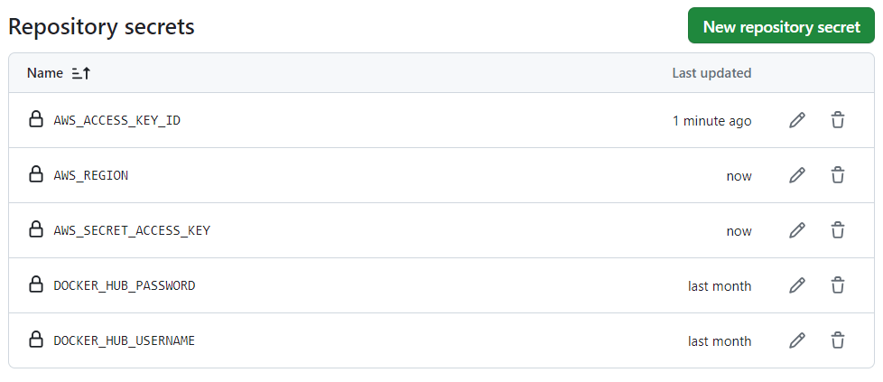

# Arbeitsweise

## Pushen auf Dockerhub

1. fehlerlose Ausführung des Programms auf dem eigenen Rechner

Zunächst einmal muss man sicherstellen, dass das Programm auf dem eigenen Rechner läuft.

Bei dieser Webanwendung teste ich dies mit `npm run build; npm run start` und öffne dann den Browser auf `localhost:3000`.

2. Testen des Programms in einem Docker-Container

3. Dockerhub repository erstellen

4. Github actions einrichten

## Pushen und Deployen auf AWS

### 1. AWS ECR repository erstellen

### 2. Pipeline erstellen

### 3. Github Actions secrets einrichten

